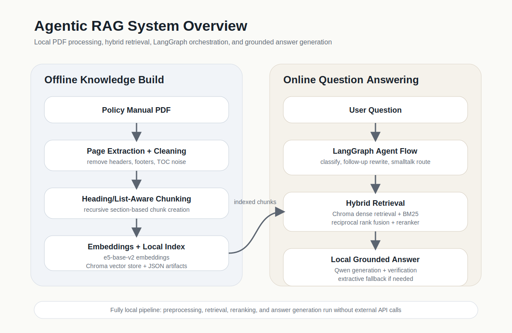

# Assignment Report

## 1. Business Context

This project supports employees with a local question-answering assistant over a policy manual PDF. Instead of manually reading a long handbook, a user can ask natural-language questions such as leave rules, payroll timing, procurement thresholds, or security policies, and receive grounded answers from the document.

## 2. System Architecture

The current implementation is an agentic RAG pipeline in `src/`:

1. load the PDF page by page
2. clean repeated headers, footers, and noisy pages
3. build heading/list-aware chunks
4. index chunk embeddings in Chroma
5. retrieve with hybrid search
6. rerank candidates
7. generate a grounded answer with a local instruct model
8. verify the answer and fall back to extractive output when needed

## 3. Key Technical Decisions

### 3.1 LLM Selection

The current local generation model is `Qwen/Qwen2.5-3B-Instruct`. It is stronger than very small CPU-friendly baselines, but still realistic to run locally on a modest consumer GPU. Larger local models were tested, but stability became an issue on the available hardware.

### 3.2 Embedding Model Selection

The project uses `intfloat/e5-base-v2` for dense retrieval. Compared to lighter sentence-transformer baselines, it gave better semantic matching on policy-style questions without relying on external APIs.

### 3.3 Retrieval Strategy

The retrieval layer is hybrid:

- dense retrieval with Chroma + `e5-base-v2`
- lexical retrieval with BM25
- result fusion with reciprocal rank fusion
- reranking with `cross-encoder/ms-marco-MiniLM-L-6-v2`

This combination worked better than pure embedding search, especially for policy titles, thresholds, and repeated terms such as harassment, records, conflict of interest, and payroll.

### 3.4 Chunking Strategy

The first block-based PDF extraction produced inconsistent layout fragments. The final solution moved to page text extraction and heading/list-aware chunking. The system now:

- filters noisy pages such as cover and table-of-contents pages
- preserves heading-like lines and lists
- builds section-like chunks before token-based splitting

This improved retrieval quality significantly over naive block extraction.

### 3.5 Framework Choice

The orchestration layer uses `LangGraph`. This allowed the project to move beyond a simple `retrieve -> answer` flow and implement agent-style decisions such as:

- question classification
- follow-up query rewriting
- broader retry search
- answer verification
- smalltalk short-circuiting

## 4. Agentic Behavior

The agentic workflow contains the following stages:

1. **Question classification**
   - identifies broad topic families such as benefits, procurement, or records
2. **Follow-up handling**
   - rewrites short contextual follow-up questions using chat history
3. **Hybrid retrieval**
   - combines semantic and lexical candidates
4. **Reranking**
   - improves top-k relevance for ambiguous questions
5. **Answer generation**
   - uses the local Qwen instruct model on retrieved context
6. **Answer verification**
   - checks for weak or unsupported answers and falls back to extractive output
7. **Smalltalk routing**
   - avoids unnecessary retrieval for acknowledgements such as `cool` or `thanks`

## 5. How I Would Measure Success In Production

I would track:

- top-1 and top-3 retrieval relevance
- groundedness of generated answers
- latency of retrieval and generation
- frequency of extractive fallback
- GPU and memory stability
- user satisfaction on real policy questions

## 6. Demo Examples

### Example 1

- **Question:** When do I get salary paid?
- **Generated answer:** Salary is paid bi-weekly. If pay day falls on a holiday or weekend, employees are paid on the last working day before the holiday or weekend. Employees can also use direct deposit.
- **Result:** Correct and grounded.

### Example 2

- **Question:** What is the holiday policy?
- **Generated answer:** CDC recognizes the listed paid holidays and allows time off on election day subject to notice requirements.
- **Result:** Correct, with extractive fallback available if generation becomes too vague.

### Example 3

- **Question:** cool
- **Generated answer:** Understood. Ask the next question when you're ready.
- **Result:** Correctly routed as smalltalk without retrieval.

## 7. Test / Evaluation Suite

The project includes a fixed evaluation query set in `data/test_queries.json` and an evaluation runner in `src/evaluate.py`.

The tested questions cover:

- holidays
- grievance procedure
- harassment policy
- direct deposit
- travel reimbursement
- whistleblower policy
- procurement methods
- records retention
- computer security

Observed outcome:

- retrieval became clearly stronger after hybrid search and reranking
- direct policy questions work well
- ambiguous questions still depend on ranking quality and model quality
- generation quality is acceptable with Qwen 3B, but guardrails are still important

## 8. Limitations

The current system still has limitations:

- local generation quality depends on GPU availability
- if CUDA is unavailable, response time becomes poor
- some answers still require extractive fallback
- retrieval is good but not perfect for repeated concepts across multiple chapters
- the system is optimized for one policy manual, not a large multi-document corpus

## 9. What Did Not Work Well

Several approaches were less successful:

- raw PDF block extraction produced inconsistent chunks
- pure embedding retrieval was weaker than hybrid retrieval
- larger local generation models caused stability problems on the available hardware
- weaker local models sometimes produced vague answers and needed stricter verification

## 10. Next Steps

The next practical improvements would be:

- stronger structured evaluation with expected-page annotations
- cleaner generation prompts for short factual answers
- optional reranker tuning and retrieval score analysis
- local model serving in a dedicated process for more stable startup behavior
- support for multiple policy documents

## 11. Reflection

The strongest lesson from this project was that retrieval quality and system stability matter at least as much as the raw generation model. The final agentic version is much stronger than the original baseline because it combines better chunking, hybrid retrieval, reranking, and a graph-based control flow instead of relying on a single direct retrieval step.
